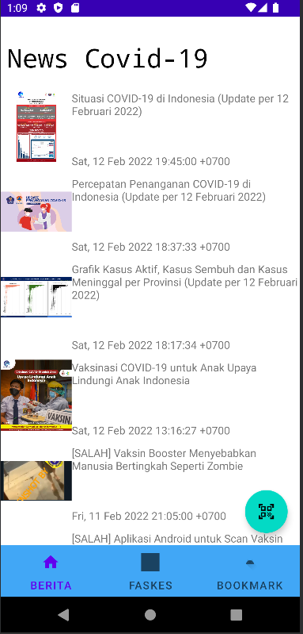
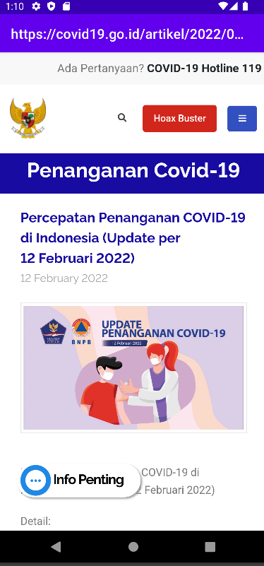

# IF3210-2022-Android-72

Tugas Besar 1 - Android
IF3210 Pengembangan Aplikasi pada Platform Khusus

## Deskripsi aplikasi.
Aplikasi Perlu dilindungi merupakan aplikasi yang berisi terkini pandemi COVID-19 di Indonesia dan masih banyak fitur lainnya. . Pengguna dapat melakukan check-in pada area publik menggunakan scan QR-Code dan pengecekan suhu secara realtime. . Pengguna juga dapat mengecek faskes terdekat dan menyimpannya pada bookmark
## Cara kerja, terutama mengenai pemenuhan spesifikasi aplikasi.
### Fitur Check-in
Apabila pengguna menekan floating button pada semua layar aplikasi, pengguna akan diminta untuk menyalakan GPS dan internet. Setelah itu, program akan menscan QR-CODE pada layar tangkapan kamera dan mengenerate suhu. Setelah itu, akan dicek apakah status check-in berwarna hijau, kuning, merah, atau hitam.
### Fitur Berita
Saat membuka aplikasi, halaman pertama yang muncul adalah halaman berita. Halaman ini berisi berita-berita terkini mengenai Covid-19. User dapat scroll ke atas atau bawah untuk melihat berita lainnya serta dapat mengklik salah satu berita untuk melihat artikel lengkap dari berita tersebut
### Fitur Faskes
Isi di sini <Fauzan>
### Fitur Bookmark
Isi di sini <Afifah>
## Library yang digunakan dan justifikasi penggunaannya.
| Nama Library | Kegunaan
| :--   | :------ |
| Zxing | Untuk membuat intent mengenai QR-Code dan lifecycle activity yang ada |
| Retrofit | Untuk menyediakan komunikasi backend pada aplikasi android |
| Lain-lain | Lain-lain
## Screenshot aplikasi (dimasukkan dalam folder screenshot).
### Fitur Check-in
Isi di sini <Leonard>
### Fitur Berita

### Fitur Faskes
Isi di sini <Fauzan>
### Fitur Bookmark
Isi di sini <Afifah>
## Pembagian kerja anggota kelompok.
1. 13519215 - Leonard Matheus : Membuat Fitur Check-in (QR-Code dan Suhu)
2. 13519207 - Rafidika Samekto : Membuat Fitur Berita
3. ***
4. ***
