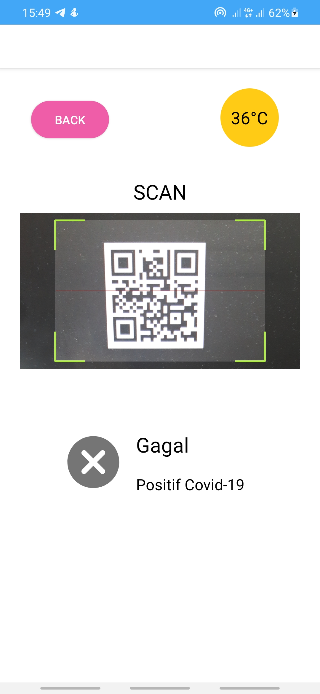
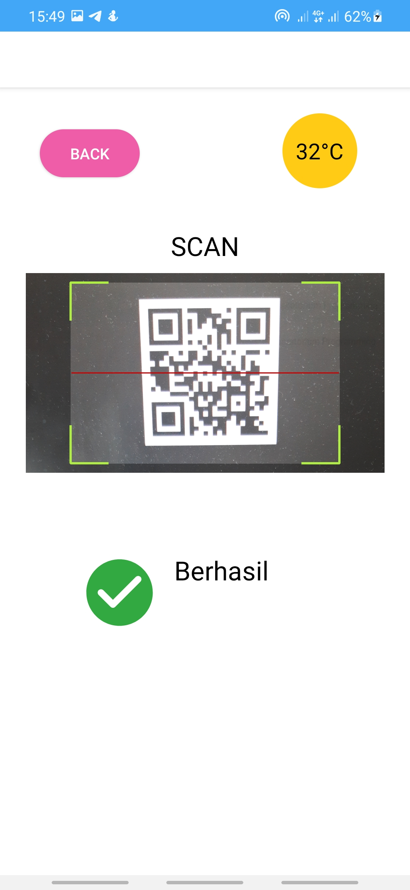
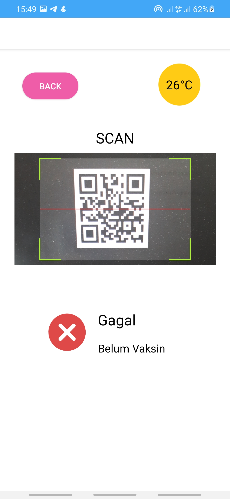
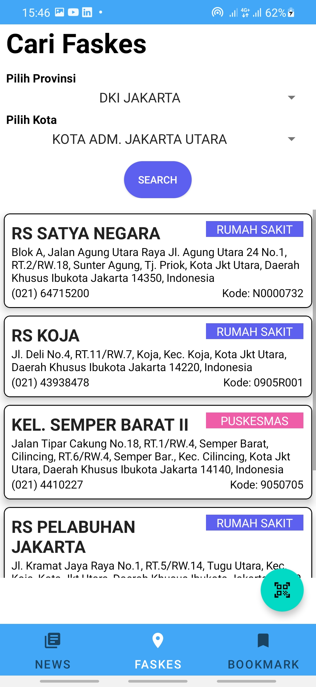
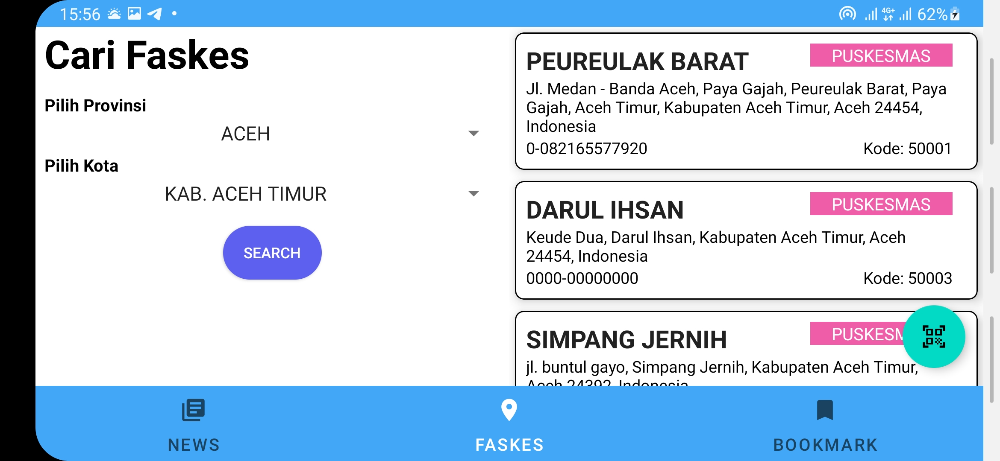
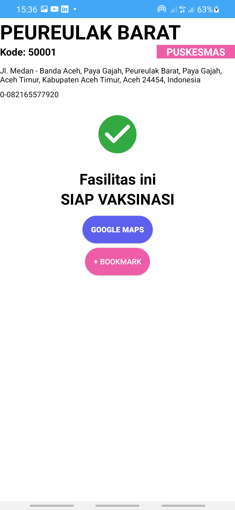
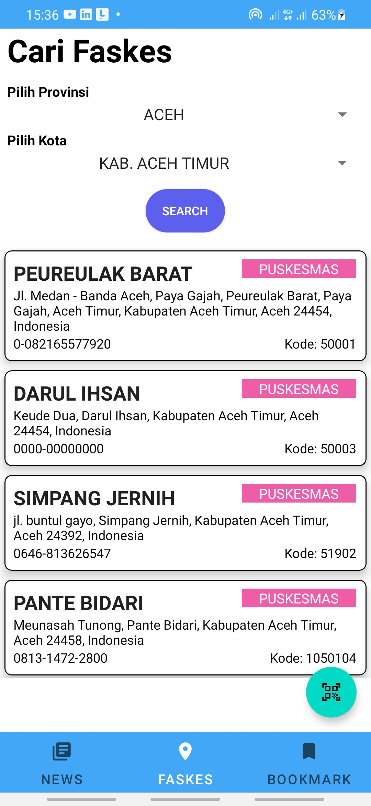

# IF3210-2022-Android-72

Tugas Besar 1 - Android
IF3210 Pengembangan Aplikasi pada Platform Khusus

## Deskripsi aplikasi.
Aplikasi Perlu dilindungi merupakan aplikasi yang berisi terkini pandemi COVID-19 di Indonesia dan masih banyak fitur lainnya. . Pengguna dapat melakukan check-in pada area publik menggunakan scan QR-Code dan pengecekan suhu secara realtime. . Pengguna juga dapat mengecek faskes terdekat dan menyimpannya pada bookmark
## Cara kerja, terutama mengenai pemenuhan spesifikasi aplikasi.
### Fitur Check-in
Apabila pengguna menekan floating button pada semua layar aplikasi, pengguna akan diminta untuk menyalakan GPS dan internet. Setelah itu, program akan menscan QR-CODE pada layar tangkapan kamera dan mengenerate suhu. Setelah itu, akan dicek apakah status check-in berwarna hijau, kuning, merah, atau hitam.
### Fitur Berita
Saat membuka aplikasi, halaman pertama yang muncul adalah halaman berita. Halaman ini berisi berita-berita terkini mengenai Covid-19. User dapat scroll ke atas atau bawah untuk melihat berita lainnya serta dapat mengklik salah satu berita untuk melihat artikel lengkap dari berita tersebut
### Fitur Faskes
Apabila pengguna menekan bagian faskes pada navigasi menu, akan muncul halaman search faskes dengan dropdown menu pilihan provinsi dan kota. Setelah memilih provinsi dan kota yang diinginkan, pengguna dapat menekan tombol search untuk menampilkan lima faskes terdekat berdasarkan pilihan provinsi dan kota.  
Jika pengguna menekan salah satu faskes, akan ditampilkan halaman detail informasi faskes. Pada halaman ini pengguna dapat menekan tombol Google Maps untuk melihat lokasi faskes pada aplikasi Google Maps dan menekan tombol bookmark untuk menambahkan atau menghilangkan bookmark pada faskes terkait.  
Selain itu, halaman search faskes memiliki responsive layout, sehingga jika orientasi aplikasi diubah antara portrait dan landscape, akan menampilkan tampilan yang berbeda.
### Fitur Bookmark
Pada halaman detail informasi faskes dan menekan sebuah tombol yang akan berubah menjadi bookmark untuk menambahkan atau unbookmark menghilangkan bookmark pada faskes terkait, maka informasi faskes akan disimpan pada local storage device sehingga user dapat mengakses tanpa koneksi internet. User dapat melihat daftar faskes yang sudah di bookmark pada halaman daftar bookmark.
## Library yang digunakan dan justifikasi penggunaannya.
| Nama Library | Kegunaan
| :--   | :------ |
| Zxing | Untuk membuat intent mengenai QR-Code dan lifecycle activity yang ada |
| Retrofit | Untuk menyediakan komunikasi backend pada aplikasi android |
| sqlite room | Menyediakan abstraksi layer untuk mempermudah operasi sqlite |
## Screenshot aplikasi (dimasukkan dalam folder screenshot).
### Fitur Check-in

### Fitur Berita

### Fitur Faskes

### Fitur Bookmark

## Pembagian kerja anggota kelompok.
1. 13519171 - Fauzan Yubairi Indrayadi : Membuat Fitur Faskes (Search daftar faskes dan detail informasi faskes)
2. 13519183 - Afifah Fathimah : Membuat Fitur Bookmark dan Recycle View Faskes
3. 13519207 - Rafidika Samekto : Membuat Fitur Berita
4. 13519215 - Leonard Matheus : Membuat Fitur Check-in (QR-Code dan Suhu)
